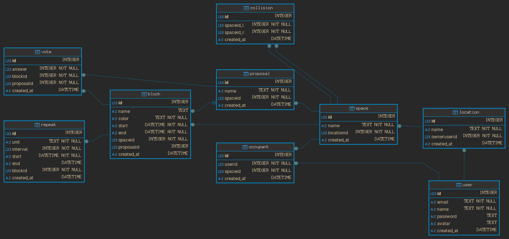

## ER Diagram

## Tables

### User

A **User** represents a person using the system.

### Space

A **Space** represents an area within a **Location**.

### Occupant

An **Occupant** represents a **User** occupying a **Space**.

### Location

A **Location** represents a physical location, comprised of **Spaces**.

- Must be associated to an owner **User**

### Block

A **Block** represents a duration of time during which the a **Space** is occupied.

- **Blocks** can be have **Occupants**; **User(s)** who are part of the **Space** occupied during the **Block**.
- A **Block** with a `proposalid` whose value is not `null` is in a pending state; awaiting vote results

### Repeat

A **Repeat** defines a repetition rule for a **Block**. **Repeats** are comprised of the following properties:

- **unit**: day | week | month | year
- **interval**: _"repeat every `n` units"_
- **start**: timestamp when the **Repeat** starts being applied
- **end**: optional timestamp when the **Repeat** stops being applied

### Proposal

A **Proposal** comprises a set of **Blocks** to be voted on by **Occupants**.

### Vote

A **Vote** represents a response to a **Proposal** for a **Block**.

### Collision

A **Collision** represents a scheduling conflict.

- Explicit **Collisions** occur when two **Blocks** at different **Spaces** at the same **Location** have time overlap,
  and at least one of the **Spaces** cannot have time overlap with the other
- Implicit **Collisions** occur when two **Blocks** at the same **Space** have time overlap
